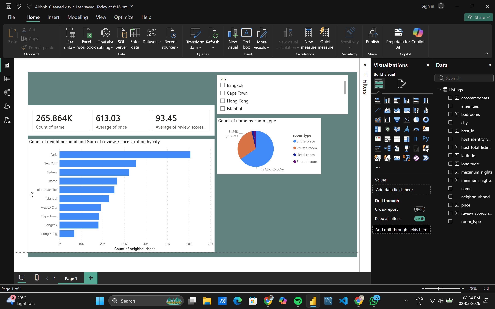

# 🏠 Airbnb Power BI Dashboard

## 📌 Project Overview  
This project focuses on analyzing Airbnb listing data using Power BI to uncover insights related to pricing, room types, and location trends.

---

## 🎯 Objectives  
- Analyze pricing trends  
- Compare room types  
- Understand customer preferences  
- Present insights using dashboard  

---

## 🛠️ Tools Used  
- Power BI  
- Microsoft Excel  

---

## 🗂️ Dataset Details  
- Dataset: Airbnb Listings  
- Rows: 1000+  
- Columns: city, neighbourhood, price, room type, ratings  

---

## 🧹 Data Cleaning  
- Removed unnecessary columns  
- Cleaned price column  
- Handled missing values  
- Removed duplicates  

---

## 📊 Dashboard Features  
- KPI Cards: Total Listings, Average Price, Average Rating  
- Bar Chart: Average Price by City  
- Pie Chart: Room Type Distribution  
- Slicer: City filter  

---

## 📷 Dashboard Preview  

---

## 💡 Insights  
- Some cities have higher prices  
- Entire homes are most common  
- Pricing varies by location  

---

## 🚀 Conclusion  
This dashboard helps understand Airbnb pricing and listing patterns using Power BI.
